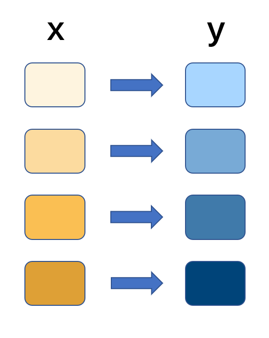
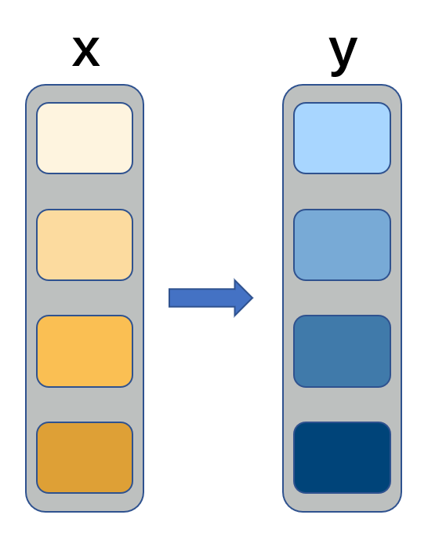
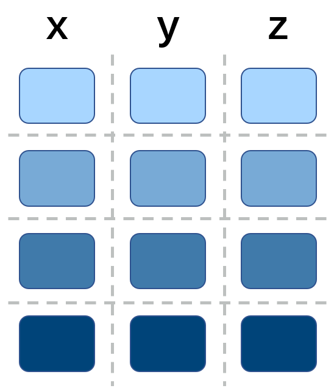
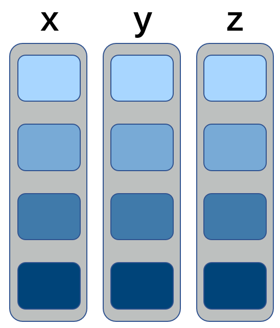
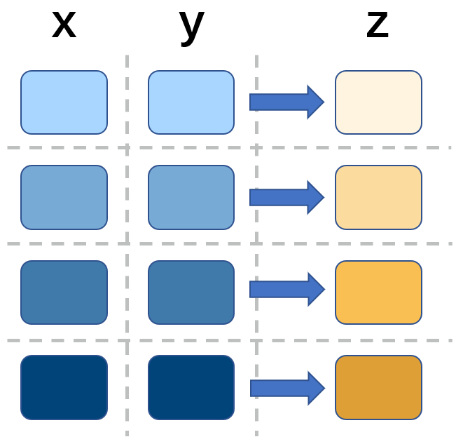
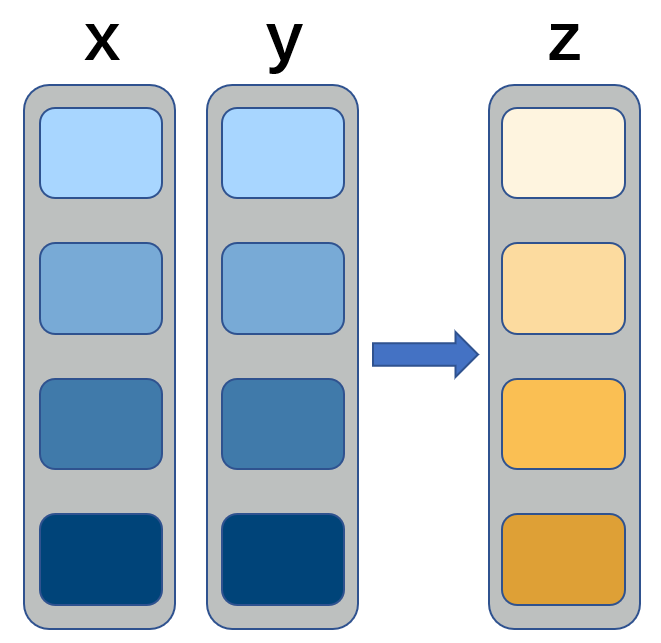

class: middle

```{r setup, include=FALSE}
knitr::opts_chunk$set(
  comment = '#>'
)
```

```{r xaringanExtra, echo=FALSE}
xaringanExtra::use_tile_view()
xaringanExtra::use_scribble(pen_color = '#E68080')
xaringanExtra::use_clipboard()
xaringanExtra::use_extra_styles()
xaringanExtra::use_progress_bar(color = "#0051BA", location = "top")

xaringanExtra::use_panelset()
```

```{css, echo=FALSE}
.red {
  color: #FF0000;
}
```

1. for loop and vectorize

1. calculation with Rcpp

1. multiple task with parallel

1. data.table and dplyr

1. string with regex

---
class: inverse, center, middle

# Get Started

---

# microbenchmark

We use package `microbenchmark` to compare the used time between different process

.panelset[
```{r, panelset = TRUE}
library(microbenchmark)
set.seed(233)

microbenchmark(
  rnorm(100),
  rnorm(10000)
)
```
]

---
class: inverse, center, middle

# for loop and vectorize

---

# for loop and vectorize

.pull-left[

- for loop operation for each elements



]

.pull-right[

- .red[vectorize operation for the entire vector]



]

---

# for loop and vectorize

.panelset[
```{r, panelset = TRUE}
func_loop <- function(x) {
  y <- numeric(length(x))
  for (i in seq_along(x)) {
    y[i] <- x[i] + 1
  }
  return(y)
}

func_vector <- function(x) {
  y <- x + 1
  return(y)
}

microbenchmark(
  func_loop(1:100),
  func_vector(1:100)
)
```
]

---
class: inverse, center, middle

# data.frame in R

---

# data.frame structure

.pull-left[

- rows × columns



]

.pull-right[

- .red[list of columns]



]

---

# data.frame structure

.panelset[

.panel[.panel-name[df]
```{r, collapse=TRUE}
df = data.frame(v = 1:4, name = c(letters[1:4]))
df

is.list(df)
as.list(df)
```
]

```{r, panelset = TRUE}
microbenchmark(
  df[3, 2],
  df[3, 'name'],
  df$name[3]
)
```
]

---

# by row and by col

.pull-left[

- operation by rows



]

.pull-right[

- .red[operation by columns]



]

---

# by row and by col

.panelset[
```{r, panelset = TRUE}
func_df_loop <- function(df) {
  for (i in seq_len(nrow(df))) {
    df[i , 'y'] <- df[i , 'x'] + 1
  }
  return(df)
}

func_df_vector <- function(df) {
  df$y <- df$x + 1
  return(df)
}

microbenchmark(
  by_row = func_df_loop(data.frame(x = 1:100)),
  by_col = func_df_vector(data.frame(x = 1:100))
)
```
]

---

# vectorize functions

.panelset[
```{r, panelset = TRUE}
df <- data.frame(x = 1:50, y = sample(1:50))

microbenchmark(
  apply(df, 1, sum),
  rowSums(df)
)

microbenchmark(
  apply(df, 1, min),
  pmin(df$x, df$y)
)
```
]

.footnote[`dplyr::rowwise()` change operations to "by row" invisibly]

---
class: inverse, center, middle

# calculation with Rcpp

---

# calculation with Rcpp

The example comes form a [article](https://cosx.org/2009/12/improve-r-computation-efficiency) more than 10 years old, here is the simplified question:

We want to calculate the p-value ot the t.test on 120 groups of vector, the length of vector in each group is 100, below is the dummy data:

```{r}
dat = matrix(rnorm(120 * 100), ncol = 100)
```

We can use `apply` and `t.test()$p.value` for calculation:

```{r}
p2 = apply(dat, 1, function(x) {t.test(x)$p.value})
```

---

# calculation with Rcpp

Note that `t.test()` do the calculation more than p.value

```{r, collapse=TRUE}
result_t_test <- t.test(dat[1, ])
result_t_test$p.value
result_t_test$conf.int
```

so we can calculate the statistics then use the t-distribution function to calculate the p-value

```{r}
nc = ncol(dat)
p4 = 2 * pt(apply(dat, 1, function(x, mu = 0) {-abs((mean(x) - mu)/sqrt(var(x)/nc))}), nc - 1)
```

---

# calculation with Rcpp

.panelset[
```{r, panelset = TRUE}
microbenchmark(
  p2 = apply(dat, 1, function(x) {t.test(x)$p.value}),
  p4 = 2 * pt(apply(dat, 1, function(x, mu = 0) {-abs((mean(x) - mu)/sqrt(var(x)/nc))}), nc - 1)
)
```
]

---

# calculation with Rcpp

We can use C++ to do the efficient calculation

```{r}
library(Rcpp)
cppFunction(code = '
NumericVector calc_pvalue(NumericMatrix x, double mu) {
    int nr = x.nrow(), nc = x.ncol(), i, j;
    NumericVector tstat(nr), pval(nr);
    double sum = 0.0, sum2 = 0.0, mean, var;
    for (i = 0; i < nr; i++) {
        for (j = 0; j < nc; j++) { sum += x(i, j); }
        mean = sum / nc;
        sum = 0.0;
        for (j = 0; j < nc; j++) { sum2 += (x(i, j) - mean) * (x(i, j) - mean); }
        var = sum2 / (nc - 1);
        sum2 = 0.0;
        tstat[i] = (mean - mu) / sqrt(var / nc);
    }
    pval = 2 * pt(-abs(tstat), (nc - 1));
    return pval;
}
')
```

---

# calculation with Rcpp

.panelset[
```{r, panelset = TRUE}
microbenchmark(
  p2 = apply(dat, 1, function(x) {t.test(x)$p.value}),
  p4 = 2 * pt(apply(dat, 1, function(x, mu = 0) {-abs((mean(x) - mu)/sqrt(var(x)/nc))}), nc - 1),
  p6 = calc_pvalue(dat, 0)
)
```
]

---
class: inverse, center, middle

# multiple task with parallel

---

# multiple task with parallel

.panelset[

.panel[.panel-name[functions]
```{r}
library(parallel)

func_task_loop <- function(n, out_len = 1e7) {
  x <- vector('list', n)
  for (i in seq_len(n)) {x[[i]] <- rnorm(out_len, mean = i)}
  return(x)
}

func_task_apply <- function(n, out_len = 1e7) {
  lapply(seq_len(n), function(i) {rnorm(out_len, mean = i)})
}

func_task_parallel <- function(n, out_len = 1e7) {
  mclapply(seq_len(n), function(i) {rnorm(out_len, mean = i)}, mc.cores = 4)
}
```
]

.panel[.panel-name[time]
```{r, collapse=TRUE}
system.time(func_task_loop(10))
system.time(func_task_apply(10))
system.time(func_task_parallel(10))
```
]

]

---
class: inverse, center, middle

# data.table and dplyr

---

# data.table and dplyr

.panelset[
```{r, panelset = TRUE}
library(data.table)
library(dplyr, warn.conflicts = F)
library(dtplyr)

df <- tibble(g = sample(1:10000, size = 1000000, replace = T), x = rnorm(1000000))

microbenchmark(
  dplyr = df %>% arrange(x),
  dtplyr = df %>% lazy_dt() %>% arrange(x) %>% as_tibble(),
  data.table = data.table(df)[order(x)]
)

microbenchmark(
  dplyr = df %>% group_by(g) %>% summarise(sum_x = sum(x)),
  dtplyr = df %>% lazy_dt() %>% group_by(g) %>% summarise(sum_x = sum(x)) %>% as_tibble(),
  data.table = data.table(df)[, .(sum_x = sum(x)), keyby = .(g)]
)
```
]

---
class: inverse, center, middle

# string with regex

---

# string with regex

cost of multiple compilation

.panelset[
```{r, panelset = TRUE}
library(dplyr, warn.conflicts = F)
library(stringr)

fruit <- rep(c('apple', 'banana', 'pear', 'pinapple'), 25)
x <- rep('a', 100)

microbenchmark(
  once1 = str_detect(fruit, '^a'),
  once2 = str_detect(fruit, str_c('^', 'a')),
  multi = str_detect(fruit, str_c('^', x))
)
```
]

---

# string with regex

use sub-string dirrectly

.panelset[
```{r, panelset = TRUE}
x <- rep(letters[1:4], 25)

microbenchmark(
  multi = str_detect(fruit, str_c('^', x)),
  sub_str = str_sub(fruit, 1, str_length(x)) == x
)
```
]

---

# string with regex

cost of lookaround

.panelset[
```{r, panelset = TRUE}
string <- c('some <div>a test</div> other <div>b test</div> strings <div>c test</div> end ') %>% str_dup(100)

microbenchmark(
  a = string %>% 
    str_extract_all('(?<=<div>)[^<]*(?=</div>)') %>% 
    unlist(),
  b = string %>% 
    str_extract_all('<div>[^<]*</div>') %>% 
    unlist() %>% 
    str_remove_all('^<div>|</div>$')
)
```
]

.footnote[
lookaround and non-greedy in regex might bring more time consuming, depends on the strings and regex
]

---

# project management

.pull-left[

战术

- improve code performance

- ask for more computing resources

]

.pull-right[

.red[战略]

- good project structure

- long-term plan about code maintaining

- communication about what we want

]

---

# sessionInfo

```{r, echo=FALSE}
sessionInfo()
```

---
class: center, middle

# Thanks!

Slides created via the R package [**xaringan**](https://github.com/yihui/xaringan) and [**xaringanExtra**](https://github.com/gadenbuie/xaringanExtra).


